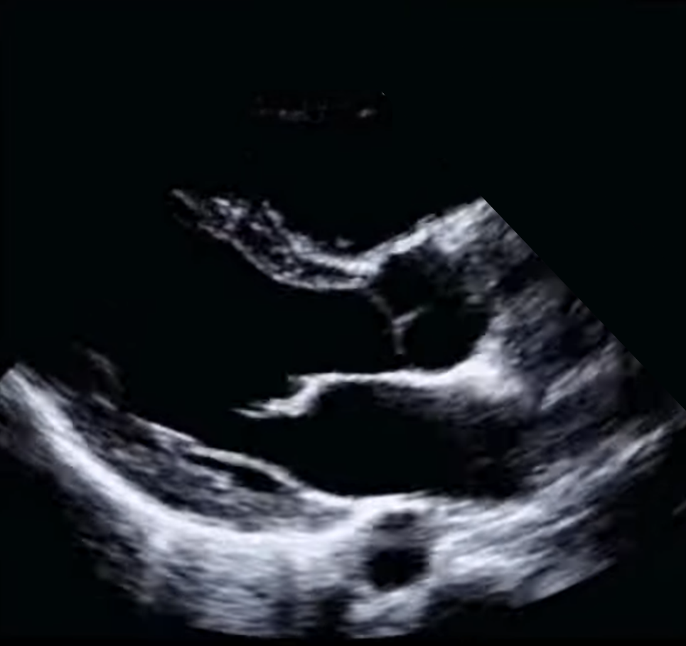

# PLAX EF Labels Dataset

This repository contains two datasets of EF (ejection fraction) labels for PLAX (parasternal long-axis) echocardiographic videos, derived from the [MIMIC-IV-ECHO](https://www.physionet.org/content/mimic-iv-echo/0.1/) and [MIMIC-IV-Note](https://physionet.org/content/mimic-iv-note/2.2/) dataset. These labels were generated through two distinct approaches and are intended for research use only. Each dataset includes labels formatted to align with the MIMIC-IV-ECHO dataset's structure, enabling seamless integration with corresponding echocardiographic files for those with appropriate access to MIMIC-IV.

> 📄 **Related publication**:  
> Our paper is accepted as an oral presentation at [MIDL 2025](https://2025.midl.io/).  
> 📘 Read it here: [https://openreview.net/forum?id=JEN5FzeFZj](https://openreview.net/forum?id=JEN5FzeFZj)

> 🎥 **Watch the talk** (starts at 5:34:30):  
> [https://www.youtube.com/watch?v=tUEeZa0O9qs&t=20070](https://www.youtube.com/watch?v=tUEeZa0O9qs&t=20070)


--- 
## 🚀 Live Demos
- **[Hugging Face Demo](https://huggingface.co/spaces/Jeff4899/202509_PLAX_EF_Demo)** – Interactive web app for EF estimation from PLAX and A4C clips, with the option to upload your own videos.  
- **[Google Colab Notebook](https://colab.research.google.com/drive/1E2IWrfpBIKI4cBoBTCn3OLwEK9o3GTMM)** – Explore and run the inference code directly in Colab.  

---
## Description of Datasets

### 1. Generated Dataset – PLAX videos with EF labels  
**File**: [`PLAX_with_EF_labels_proxy_dataset.csv`](PLAX_with_EF_labels_proxy_dataset.csv)  

This dataset provides EF labels generated using proxy labels and paired with PLAX echocardiographic videos.  
- **Content**: 25,532 PLAX videos across 4,822 studies.  
- **Purpose**: Enables large-scale training of machine learning models for EF prediction.  
- **Note**: See our paper for the generation pipeline.  

---
### 2. Ground Truth Dataset – PLAX videos with EF labels  
**File**: [`PLAX_with_EF_labels_ground_truth_dataset.csv`](PLAX_with_EF_labels_ground_truth_dataset.csv)

This dataset provides EF labels derived directly from clinical notes and paired with PLAX echocardiographic videos.  
- **Content**: 1,708 PLAX videos across 295 studies.
- **Purpose**: Serves as a high-quality dataset for evaluating PLAX EF prediction models.  
- **Generation Process**:  
  - Matched echocardiography studies with discharge summaries within a 1-day window to maximize temporal accuracy.  
  - Used GPT-4 NLP to extract EF values from free-text notes. The extraction prompts used are provided in [`GPT4_NLP_EF_Extraction_Prompts.ipynb`](GPT4_NLP_EF_Extraction_Prompts.ipynb).  
  - Cross-validated extracted EF values with predictions from a trained A4C model (based on [EchoNet-Dynamic](https://echonet.github.io/dynamic/)), achieving a mean absolute error (MAE) of 6.64%.  


---

## 📑 File Format
Both datasets are provided as CSV files with the following columns:
- **subject_group**: Corresponds to the `pXX` group in MIMIC-IV-ECHO.
- **subject_id**: Corresponds to the `pXXXXXXX` ID in MIMIC-IV-ECHO.
- **study_id**: Corresponds to the `sXXXXXXX` ID in MIMIC-IV-ECHO.
- **file_id**: Corresponds to the `XXXX_XXXX` file identifier in MIMIC-IV-ECHO.
- **EF_value**: Ejection fraction value (percentage).

Example row:
```
p10,p10872900,s96990073,96990073_0057,66.43
```


Example PLAX Echocardiographic View:



*Note: This image is not sourced from the MIMIC dataset. It is an illustrative example obtained from an online source.*

---

## 🔧 Usage Instructions
To use these labels:
1. Ensure you have access to the MIMIC-IV-ECHO dataset.
2. Use the `subject_group`, `subject_id`, `study_id`, and `file_id` columns to locate the corresponding DICOM echo files in MIMIC-IV-ECHO.
3. The `EF_value` column provides the EF percentage for the corresponding video.
   
---

## 📦 Models and Code
- Example inference code is provided in the [Colab notebook](https://colab.research.google.com/drive/1E2IWrfpBIKI4cBoBTCn3OLwEK9o3GTMM).  
- Pretrained models are available on Hugging Face: [PLAX Models](https://huggingface.co/Jeff4899/202509_PLAX_EF).
  
**Note**: In the MIDL 2025 paper, EF prediction was aggregated from **4 PLAX models**.  
In practice, a simpler **50%–50% aggregation of 2 PLAX models ** provides comparable results.  
Therefore, only two PLAX models are uploaded to Hugging Face.  
The datasets are unchanged.

---

## License
This dataset is derived from the MIMIC-IV-ECHO and MIMIC-IV-NOTE datasets. Use of this dataset must comply with the MIMIC-IV Data Use Agreement. The labels are shared under the Creative Commons Attribution-NonCommercial 4.0 International (CC BY-NC 4.0) license. For full license details, see [CC BY-NC 4.0](https://creativecommons.org/licenses/by-nc/4.0/).

## Citation
If you use this dataset, please cite the following paper:
```
@inproceedings{
gao2025machine,
title={Machine Learning with Scarce Data: Ejection Fraction Prediction Using {PLAX} View},
author={Zhiyuan Gao and Dominic Yurk and Yaser S. Abu-Mostafa},
booktitle={Medical Imaging with Deep Learning},
year={2025},
url={https://openreview.net/forum?id=JEN5FzeFZj}
}
```

## References
This dataset is derived from the following publicly available datasets:
- MIMIC-IV-ECHO: Johnson AEW, Pollard TJ, Shen L, et al. (2020). MIMIC-IV Clinical Database. Version 2.0. Available at: https://www.physionet.org/content/mimic-iv-echo/0.1/
- MIMIC-IV-NOTE: Johnson AEW, Pollard TJ, Shen L, et al. (2020). MIMIC-IV Clinical Database. Version 2.0. Available at: https://physionet.org/content/mimic-iv-note/2.2/
- Ouyang, D., He, B., Ghorbani, A. et al. Video-based AI for beat-to-beat assessment of cardiac function. Nature 580, 252–256 (2020). https://doi.org/10.1038/s41586-020-2145-8

Access to the original datasets requires completion of the PhysioNet Data Use Agreement.


